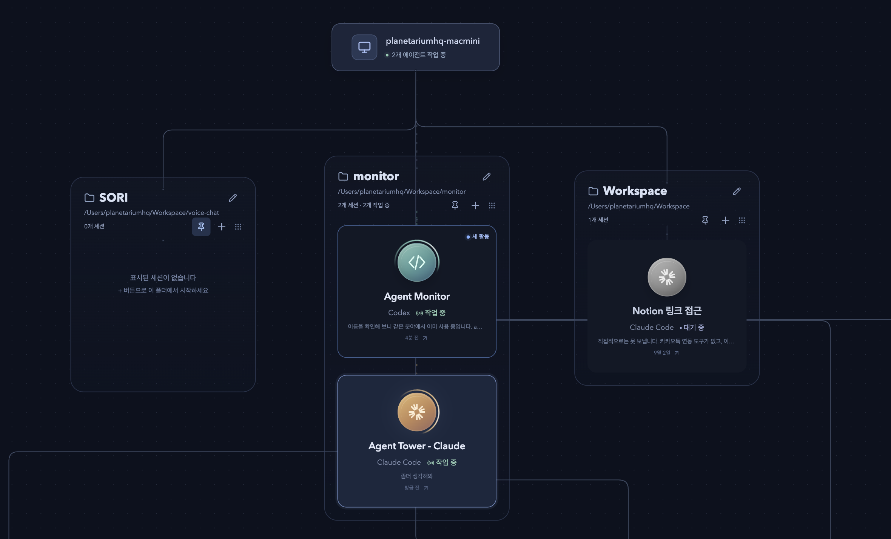

# Agent Session Tower

[한국어](README.ko.md)

**Keep using your Claude Code and Codex harnesses. Monitor and manage your agents at a glance in a web UI.**

Especially useful when running multiple agents across sessions or managing them remotely.

Run one command to see your existing local sessions organized by project on a live node graph:

```sh
npx --yes github:kimwz/agent-session-tower
```

Or clone the repository and run it locally:

```sh
git clone https://github.com/kimwz/agent-session-tower.git
cd agent-session-tower
npm ci
npm start
```

`npm ci` installs dependencies and builds the app automatically.

Your browser opens at **http://localhost:8000** with a canvas like this:



Requires **Node.js 22.13+**, **npm**, and **Git**. Use your existing Claude Code or Codex installation and sign-in. The first run downloads and builds the app; later runs reuse npm's cache. Tested on macOS. The web UI supports **English and Korean**.

## Browser editor and terminal

Use the editor or terminal icons on a project folder or session to open its workspace in a resizable overlay on the right. When chat is open, the workspace sits to its left without overlapping it. Drag the overlay’s left edge to adjust its width (minimum 420px, or the available viewport width). The workspace and chat each remember their last adjusted width in this browser. On narrow screens, the workspace and chat stack vertically. The file explorer supports opening files, creating files and folders, and saving edits with Ctrl/Cmd+S. Unsaved changes prompt before switching files or leaving. Saves detect external changes instead of overwriting them; use Reload file to load the latest version after resolving a conflict.

The integrated terminal runs an interactive shell in that folder on the Tower server. It works remotely without a desktop editor or terminal app. The terminal icon opens a terminal-only view. Use **Restore terminal** to show the editor and file browser alongside it, or **Maximize terminal** to hide them again. Toggle the terminal panel without ending its shell, or use **Close terminal** to stop it. File edits and terminal commands affect the server's actual workspace.

## What you can do

- **See existing sessions immediately.** Automatically discovers local Claude Code and Codex histories, including sessions started outside Tower.
- **Follow work on a live graph.** View projects, sessions, and subagents together, with working, waiting, completed, and error states. Temporary projects under `/tmp` and `/private/tmp` stay off the canvas; their sessions remain accessible in the sidebar.
- **Check account usage.** See Claude Code and Codex usage as small donuts inside the machine node. Hover or focus for usage windows and reset times.
- **Create new sessions.** Choose Claude Code or Codex, pick a project folder, and send the first request from the web. A folder that does not exist yet is created, and the folder is marked as trusted for that CLI so it does not stop at the trust prompt.
- **Route a prompt automatically.** Open **Auto Prompt** from the sparkle button on a machine or folder. A separate Opus or GPT Sol agent chooses a suitable existing session or starts a new one, and shows its reason.
- **Continue a conversation.** Read the original history and send the next instruction to the same native session. Attach files or paste images.
- **Insert a queued request into active work.** Click **Send into current turn** on an eligible queued request to deliver it to the same active Claude Code or Codex turn without stopping it. Available for turns controlled by Tower; a different model must wait for the next turn. Unconfirmed delivery is never retried automatically.
- **Choose a model and reasoning effort.** Keep the agent's defaults or select a model and effort level for your next request, a new session, or an Auto Prompt.
- **Approve tools and answer questions in chat.** Tower-launched sessions keep native permission settings. Review actions from Codex and its child agents, answer questions, and complete supported connector forms in the web UI. Existing Codex desktop sessions handle approvals in their original app.
- **Keep projects stable.** Sessions stay grouped under their starting folder even when an agent changes directories while working. Resuming from Tower uses that project folder.
- **Keep branches in sync.** A git project folder shows how many commits its branch is behind (↓) or ahead of (↑) its upstream. Tower fetches in the background and, before it starts work in a folder, fast-forwards a branch that is only behind, with no uncommitted changes and no agent working there. Anything else waits for you: open the badge to pull or push (never forced).
- **Give every agent the same ground rules.** On start, Tower adds a short section to your global `~/.claude/CLAUDE.md` (an import of `~/.agent-monitor/agent-guidance.md`) and `~/.codex/AGENTS.md`: fetch and fast-forward before changing a repository, use a separate worktree when another agent shares the folder, and do not leave commits unpushed without saying so. The rest of those files is left as is. To keep Tower out of a file, write `<!-- agent-session-tower:off -->` in it.
- **Organize your workspace.** Rename sessions and project groups, pin projects, drag nodes, search, filter, and hide or reopen sessions.
- **Catch new activity.** Unread indicators help you find replies and results you have not opened yet.
- **Access it remotely.** Open the web UI from another device on your LAN or VPN, with password-protected access to the machine running your agents.

Local use needs no Tower login, API key, database, or CLI hooks; the only provider files Tower writes are the guidance sections above. Remote use requires an account configured on the host. Your agents keep using their existing CLI accounts and model settings.

## Remote access

Stop the running Tower with `Ctrl+C`, then start it with:

```sh
npx --yes github:kimwz/agent-session-tower --host 0.0.0.0 --port 8000
```

On the host, open `http://localhost:8000`, expand the navigation, and use the account icon at the upper right to set an ID/password. Then open the printed network address from your other device and sign in. Local access needs no login. Five failed logins from an IP permanently block it; review attempts and unblock IPs in local Account management. Passwords are stored only as salted hashes. Keep the host machine and Tower running.

Direct access uses HTTP, so use an encrypted VPN or a separately secured HTTPS deployment. See [remote access details](docs/usage.md#remote-access).

## More

- [Usage, CLI options, and how sessions work](docs/usage.md)
- [Run from source and contribute](docs/development.md)
- [MIT license](LICENSE)
