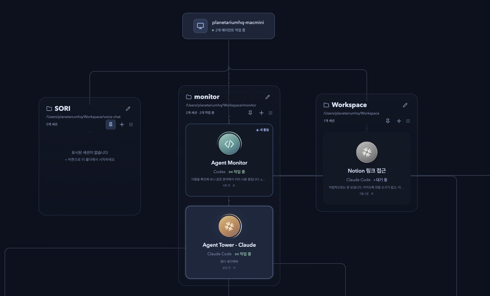

# Agent Session Tower

[한국어](README.ko.md)

**Keep using your Claude Code and Codex harnesses. Monitor and manage your agents at a glance in a web UI.**

Especially useful when running multiple agents across sessions or managing them remotely.

Run one command to see your existing local sessions organized by project on a live node graph:

```sh
npx --yes github:kimwz/agent-session-tower
```

Or clone the repository and run it locally:

```sh
git clone https://github.com/kimwz/agent-session-tower.git
cd agent-session-tower
npm ci
npm start
```

`npm ci` installs dependencies and builds the app automatically.

Your browser opens at **http://localhost:8000** with a canvas like this:



Requires **Node.js 22.22.3+ (22.x), 24.15.0+ (24.x), or 26.0.0+ (26.x)**, **npm**, and **Git**. Use your existing Claude Code or Codex installation and sign-in. The first run downloads and builds the app; later runs reuse npm's cache. SQLite support floors were verified on macOS arm64 and Linux x64; Windows, macOS x64, other architectures and new Node majors remain unverified. The storage SDK also checks the actual SQLite runtime for the WAL-reset fix (3.51.3+ or official 3.44.6/3.50.7 backports). The web UI supports **English and Korean**.

## Browser editor and terminal

Use the editor or terminal icons on a project folder or session to open its workspace in a resizable overlay on the right. When chat is open, the workspace sits to its left without overlapping it. Drag the overlay’s left edge to adjust its width (minimum 420px, or the available viewport width). The workspace and chat each remember their last adjusted width in this browser. On narrow screens, the workspace and chat stack vertically. The file explorer supports opening files, creating files and folders, and saving edits with Ctrl/Cmd+S. Unsaved changes prompt before switching files or leaving. Saves detect external changes instead of overwriting them; use Reload file to load the latest version after resolving a conflict. An absolute file path in a conversation — a Markdown link, inline code or plain text — opens that file in this editor when it lies in a folder Tower lists on the conversation's own computer; the editor shows the reason when a file cannot be opened, such as a binary file.

The integrated terminal runs an interactive shell in that folder on the Tower server. It works remotely without a desktop editor or terminal app. The terminal icon opens a terminal-only view. Use **Restore terminal** to show the editor and file browser alongside it, or **Maximize terminal** to hide them again. Toggle the terminal panel without ending its shell, or use **Close terminal** to stop it. File edits and terminal commands affect the server's actual workspace.

## What you can do

- **See existing sessions immediately.** Automatically discovers local Claude Code and Codex histories, including sessions started outside Tower.
- **Follow work on a live graph.** View projects, sessions, and subagents together, with working, waiting, completed, and error states. Temporary projects under `/tmp` and `/private/tmp` stay off the canvas; their sessions remain accessible in the sidebar.
- **Check account usage.** See Claude Code and Codex usage as small donuts inside the machine node. Hover or focus for usage windows and reset times.
- **Create new sessions.** Choose Claude Code or Codex, pick a project folder, and send the first request from the web. A folder that does not exist yet is created, and the folder is marked as trusted for that CLI so it does not stop at the trust prompt.
- **Route a prompt automatically.** Open **Auto Prompt** from the sparkle button on a machine or folder. A separate routing agent (its model is set in **Settings → Model**) chooses a suitable existing session or starts a new one, and shows its reason.
- **Fast suggestions and quieter notifications (optional).** Save a Jev API key under **Settings → Fast judgment**. Auto Prompt then suggests the project and conversation while you type; keep the checkbox on to send there at once. Notifications skip turns that were only an intermediate step.
- **Continue a conversation.** Read the original history and send the next instruction to the same native session. Attach files or paste images.
- **Insert a queued request into active work.** Click **Send into current turn** on an eligible queued request to deliver it to the same active Claude Code or Codex turn without stopping it. Available for turns controlled by Tower; a different model must wait for the next turn. Unconfirmed delivery is never retried automatically.
- **Choose a model and reasoning effort.** Keep the agent's defaults or select a model and effort level for your next request, a new session, or an Auto Prompt.
- **Approve tools and answer questions in chat.** Every turn you start in Tower, or that your agents hand off through it, runs in the provider's automatic approval mode: Claude Code's auto mode and Codex's automatic review. What still needs you, including everything where that mode is unavailable, appears in the web UI: actions from Codex and its child agents, questions, and supported connector forms. Existing Codex desktop sessions handle approvals in their original app.
- **Keep projects stable.** Sessions stay grouped under their starting folder even when an agent changes directories while working. Resuming from Tower uses that project folder.
- **Keep branches in sync.** A git project folder shows how many commits its branch is behind (↓) or ahead of (↑) its upstream. Tower fetches in the background and, before it starts work in a folder, fast-forwards a branch that is only behind, with no uncommitted changes and no agent working there. Anything else waits for you: open the badge to pull or push (never forced).
- **Give every agent the same ground rules.** On start, Tower adds a short section to your global `~/.claude/CLAUDE.md` (an import of `~/.agent-monitor/agent-guidance.md`) and `~/.codex/AGENTS.md`: fetch and fast-forward before changing a repository, use a separate worktree when another agent shares the folder, and do not leave commits unpushed without saying so. The rest of those files is left as is. To keep Tower out of a file, write `<!-- agent-session-tower:off -->` in it.
- **Organize your workspace.** Rename sessions and project groups, pin projects, drag nodes, search, filter, and hide or reopen sessions.
- **Catch new activity.** Unread indicators help you find replies and results you have not opened yet.
- **Access it remotely.** Open the web UI from another device on your LAN or VPN, with password-protected access to the machine running your agents.
- **Use encrypted secrets.** Register values, dotenv bundles and files in **Settings → Secrets**, then connect selected keys and fields to a project or the current task. Agents receive references and use tools with explicit permissions.
- **Back up and move your setup.** **Settings → Backup** exports triggers, permission rules, Slack, public agents, skills and guidance, fast judgment and folder settings as one passphrase-encrypted file, and restores it on another computer without stopping running work. It can also upload encrypted backups on a schedule to S3-compatible storage such as Cloudflare R2. Sessions and remote computer links are not included.
- **Stay up to date.** Installed as the background service (`agent-session-tower service install`), Tower keeps itself, Claude Code and Codex at their latest releases, and computers it controls follow it. Running agents and terminals are never interrupted. See [staying up to date](docs/usage.md#staying-up-to-date).

Local use needs no Tower login, API key, database, or CLI hooks; besides the guidance sections above, Tower writes to agent settings only the folder trust entry for sessions it creates, Codex's `tower.rules` for permission rules you allow, and links to skills kept in Tower. Remote use requires an account configured on the host. Your agents keep using their existing CLI accounts and model settings.

## Encrypted secrets

Use secret management from localhost or an authenticated HTTPS endpoint. Remote HTTP cannot accept vault passwords or secret input.

Open **Settings → Secrets** to create a Vault with a separate password of at least 12 characters, unlock or lock it, and change its password. Register a scalar value, a dotenv bundle, or a file. Global storage does not grant access to every project: choose a project, or explicitly enable **Allow all projects**. Project rules can connect automatically or require a manual connection. A discovery-only rule lists metadata without permitting use. Select the allowed computer, keys, dotenv fields and operations for each rule.

The conversation's secret controls connect values to its current security task. This task survives turn completion, conversation summaries and web reconnects. End it explicitly, archive the session, or let its expiry revoke access. Revocation applies to later uses; it cannot take back plaintext already delivered to a consumer. A run bound to a closed task cannot switch to a new one.

Agents use Tower's `secrets_list`, `secrets_run`, `secrets_compare`, `secrets_fingerprint` or `secrets_cli` tools. Lists contain names and references, never values, and still work while the vault is locked; using a secret then asks the owner to unlock it. Programs receive secrets through environment variables, stdin or private files, with masked stdout/stderr returned to the agent. Selected dotenv fields can be supplied as an environment bundle; whole-file delivery requires all fields. Comparison and domain-scoped HMAC fingerprints require their own operation permission.

The direct `agent-session-tower secrets` CLI requires the current run's `TOWER_SECRET_CAPABILITY` and `TOWER_SECRET_STATE_DIR`; an ordinary shell or a supplied session/project ID does not create authorization. `run` and `pipe` require a stable `--operation-id ID` that stays the same on retries. A response with uncertain execution state must not be retried as a new operation. There is no raw-value `read` or `export` command. See [the CLI and protection boundaries](docs/development.md#encrypted-secrets).

For another computer, join it through Tower's existing link, create and unlock a separate Vault on each computer, and approve each other's secret public-key fingerprints. On source A, bind one logical project to A's and B's exact computer/root pairs and grant B its permitted operations and fields. B may use a different local project ID. Both Vaults must be unlocked; B gets sealed responses instead of a permanent replica. Remote tasks expire after eight hours, and a locked or offline source denies new access. To attach manually, choose B's session on A's secret page. B's remote listing cannot edit or delete A's values.

The password protects a random Vault key using Argon2id (64 MiB, three passes, four lanes); AES-256-GCM encrypts both permanent storage and the separate runtime journal. Every new execution worker starts locked. This protects saved state, not against arbitrary code running as the same OS user or a trusted consumer that receives plaintext. Output masking does not stop every deliberate transformation or file/network disclosure.

Backups include the encrypted permanent Vault, excluding temporary values, tasks and the journal. Existing trigger secrets migrate into encrypted storage at Vault initialization, preserving their IDs and grants and removing the old plaintext file after verification. Restore first waits for target unlock and an explicit import: the encrypted Vault needs its **original Vault password**, while older trigger secrets and a deferred trigger snapshot need the **backup passphrase**. These may appear as separate pending records. Trigger definitions and grants wait with their snapshot until the required secrets are available. Source device identity and peer trust are not copied, and imported sharing rules/bindings are not activated automatically.

## Remote access

Stop the running Tower with `Ctrl+C`, then start it with:

```sh
npx --yes github:kimwz/agent-session-tower --host 0.0.0.0 --port 8000
```

On the host, open `http://localhost:8000` and set an ID/password in **Settings → Account** (the button at the upper right). Then open the printed network address from your other device and sign in. Local access needs no login. Five failed logins from an IP permanently block it; review attempts and unblock IPs in local Account management. Passwords are stored only as salted hashes. Keep the host machine and Tower running.

Direct access uses HTTP, so use an encrypted VPN or a separately secured HTTPS deployment. See [remote access details](docs/usage.md#remote-access).

## More

- [Usage, CLI options, and how sessions work](docs/usage.md)
- [Run from source and contribute](docs/development.md)
- [MIT license](LICENSE)
