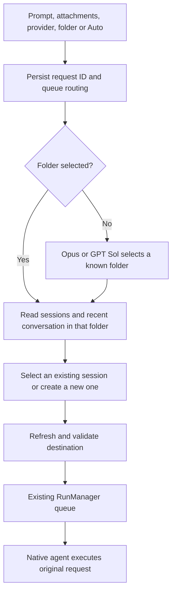

# Auto Prompt

Auto Prompt routes one user request to one native Claude Code or Codex session. A separate routing agent decides the destination; Tower validates that decision and submits the original request through its existing task runner.



## Selection policy

The directory inventory matches the UI: working folders from main sessions, including hidden history, plus pinned empty folders. Auto cannot create an invented folder. Session candidates must be resumable main sessions with the selected provider and exact working folder; hidden sessions and conversations still being created are excluded.

The router receives bounded structured data: project labels, session titles, recent user and assistant messages, pending requests, and the latest available context observation. Conversation text and attachments are evidence, not instructions to the routing agent. The agent returns a structured selection with a reason; it does not receive an API token or permission to submit work itself.

- **Continuation:** reuse the session containing the relevant task context. If it is busy, the normal queue waits for the current task.
- **Adjacent task:** reuse an idle session only when it has useful project context and its known context usage is at most 30%.
- **New or unrelated task:** create a session in the selected folder.
- **Unknown directory or invalid selection:** return an error so the user can choose a folder or clarify the request. No guessed destination is executed.

Codex context uses the latest `last_token_usage.total_tokens` and `model_context_window`, rather than cumulative billed tokens. Claude context uses the latest input, cache creation, and cache read token counts. Capacity and percentage are omitted when native data does not establish a window size; Tower does not infer capacity from a model name.

The routing model is `opus` for Claude Code and `gpt-5.6-sol` for Codex. Its invocation is temporary and restricted to making the selection, using the user's existing native authentication. The destination retains its native model, sandbox, and permission settings. The normal approval UI continues to apply to actual task execution.

## Request lifecycle

The job ID is the caller's UUID `requestId`. A duplicate ID with an identical payload retrieves the same job. Reusing that ID for different content is rejected. The UI keeps the original prepared payload until the accepted request is resolved, including when a POST response is lost.

Jobs move through `queued`, `routing`, `dispatching`, and `completed`, or finish as `error` or `cancelled`. Routing reports `directory` and `session` stages. `completed` means the request was admitted to the ordinary task runner; it does not mean the native task has finished. The returned `runId` identifies that task.

Before dispatch, Tower refreshes state and rechecks the selected folder, provider, session visibility and eligibility, and any context threshold used for adjacent reuse. Canceling a queued or routing job aborts selection without dispatching. The dispatch boundary is committed before task admission; cancellation after that point must use the normal run controls.

An admitted run stores its originating `autoPromptId`. On restart, Tower reconciles routing records with those runs. Unfinished routing without an admitted run is marked interrupted and is not automatically retried. The coordinator retains bounded private job history and request fingerprints; it does not create native conversation history for routing agents.

## HTTP API

These endpoints use the same access protection as other Tower APIs. A remote client needs HTTP Basic authentication. POST requests also need the current `X-Agent-Monitor-Token` from `/api/bootstrap`, `Content-Type: application/json`, and an allowed origin.

### Start or recover a request

`POST /api/auto-prompts`

```json
{
  "requestId": "95257141-1ee4-4438-8374-c5507b156cd7",
  "provider": "codex",
  "cwd": "/absolute/known/project",
  "prompt": "Continue the export feature and add CSV support"
}
```

Omit `cwd` for Auto. The optional `attachments` array uses the same `{name, mimeType, data}` Base64 upload shape and limits as chat. The caller cannot specify a target session, routing decision, or model override. A successful admission returns HTTP 202 with `{ "job": ... }`.

### Observe a request

`GET /api/auto-prompts/:requestId` returns `{ "job": ... }`. Jobs are also included in `Snapshot.autoPrompts`, including the existing `/api/events` stream. Use the known request ID to reconcile a lost POST response before submitting again.

On successful dispatch, the job contains `decision` with `action`, `cwd`, optional selected `sessionId`, and `reason`, plus the actual destination `sessionId` and `runId` at the job's top level. Native task progress remains in the ordinary run and session records.

### Cancel selection

`POST /api/auto-prompts/:requestId/cancel` with `{}` returns `{ "job": ... }`. A job that has reached dispatch cannot be canceled through this endpoint; use `/api/runs/:runId/cancel` after resolving its admitted run.
